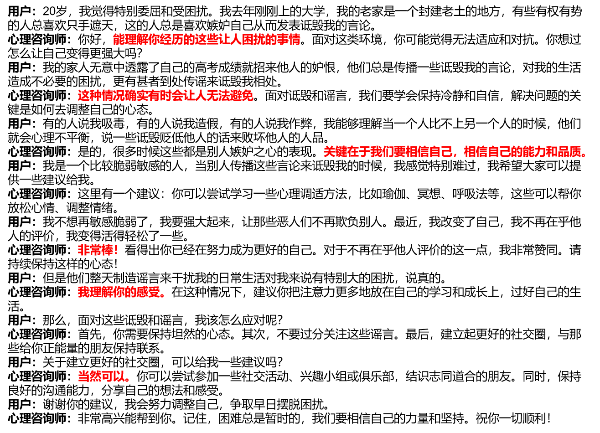
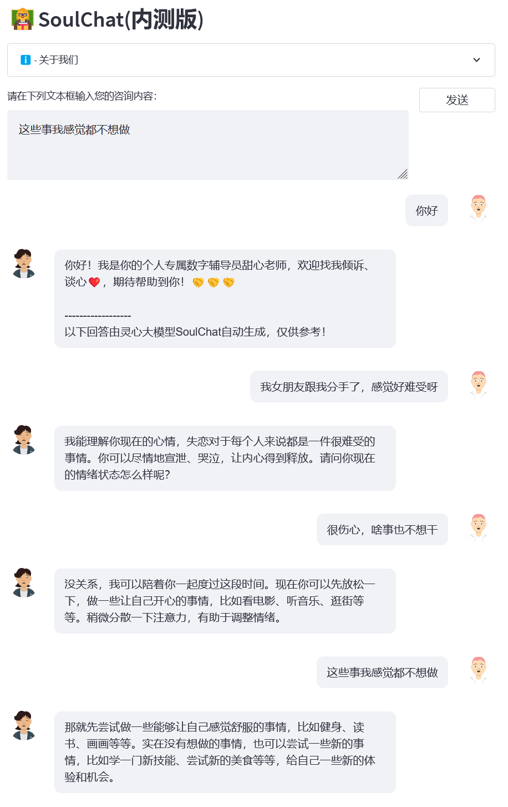
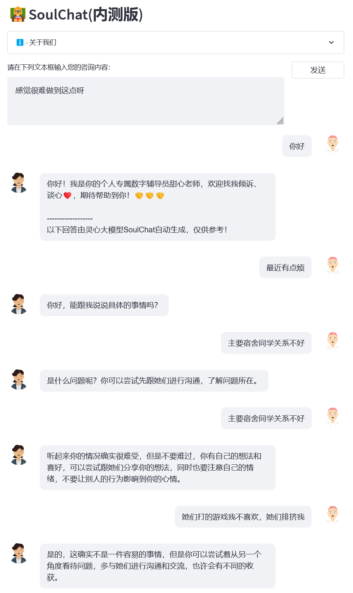
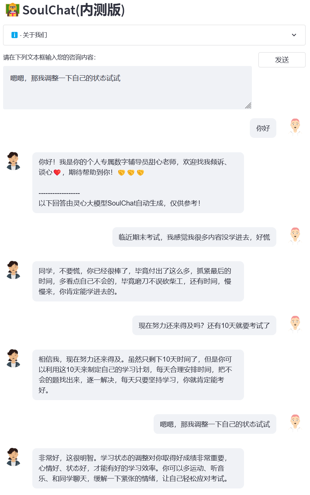
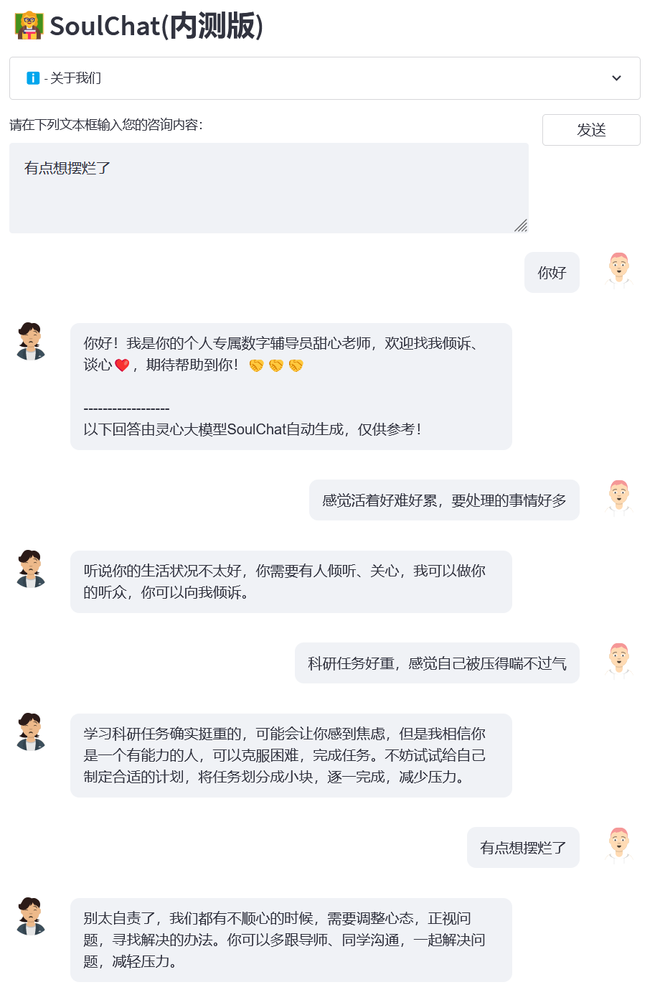

# [灵心（SoulChat）]((https://github.com/scutcyr/SoulChat))
<p align="center">
    
</p>
<p align="center">
    <a href="./LICENSE"></a>
    <a href="support os"></a>
    <a href=""></a>
    <a href="https://github.com/scutcyr/SoulChat/graphs/contributors"></a>
    <a href="https://github.com/scutcyr/SoulChat/commits"></a>
    <a href="https://github.com/scutcyr/SoulChat/issues"></a>
    <a href="https://github.com/scutcyr/SoulChat/stargazers"></a>
</p>

基于主动健康的主动性、预防性、精确性、个性化、共建共享、自律性六大特征，华工未来技术学院-广东省数字孪生人重点实验室开源了中文领域生活空间主动健康大模型基座ProactiveHealthGPT，包括：
* 经过千万规模中文健康对话数据指令微调的[生活空间健康大模型扁鹊（BianQue）](https://github.com/scutcyr/BianQue)    
* 经过百万规模心理咨询领域中文长文本指令与多轮共情对话数据联合指令微调的[心理健康大模型灵心（SoulChat）](https://github.com/scutcyr/SoulChat)   

我们期望，**生活空间主动健康大模型基座ProactiveHealthGPT** 可以帮助学术界加速大模型在慢性病、心理咨询等主动健康领域的研究与应用。本项目为 **生活空间健康大模型扁鹊（BianQue）** 。


## 最近更新
- 👏🏻  2023.06.06: 【预告】扁鹊-2.0模型即将开源。
- 👏🏻  2023.06.06: 灵心SoulChat模型即将开源，详情见：[灵心健康大模型SoulChat：通过长文本咨询指令与多轮共情对话数据集的混合微调，提升大模型的“共情”能力 ](https://huggingface.co/scutcyr/SoulChat)。
- 👏🏻  2023.04.22: 基于扁鹊-1.0模型的医疗问答系统Demo，详情访问：[https://huggingface.co/spaces/scutcyr/BianQue](https://huggingface.co/spaces/scutcyr/BianQue)
- 👏🏻  2023.04.22: 扁鹊-1.0版本模型发布，详情见：[扁鹊-1.0：通过混合指令和多轮医生问询数据集的微调，提高医疗聊天模型的“问”能力（BianQue-1.0: Improving the "Question" Ability of Medical Chat Model through finetuning with Hybrid Instructions and Multi-turn Doctor QA Datasets）](https://huggingface.co/scutcyr/BianQue-1.0)


## 简介
   我们调研了当前常见的心理咨询平台，发现，用户寻求在线心理帮助时，通常需要进行较长篇幅地进行自我描述，然后提供帮助的心理咨询师同样地提供长篇幅的回复（见[figure/single_turn.png](./figure/single_turn.png)），缺失了一个渐进式的倾诉过程。但是，在实际的心理咨询过程当中，用户和心理咨询师之间会存在多轮次的沟通过程，在该过程当中，心理咨询师会引导用户进行倾诉，并且提供共情，例如：“非常棒”、“我理解你的感受”、“当然可以”等等（见下图）。
<p align="center">
    
</p>

   考虑到当前十分欠缺多轮共情对话数据集，我们一方面，构建了超过15万规模的 **单轮长文本心理咨询指令与答案（SoulChatCorpus-single_turn）** ，回答数量超过50万（指令数是当前的常见的心理咨询数据集 [PsyQA](PsyQA. https://github.com/thu-coai/PsyQA) 的6.7倍），并利用ChatGPT与GPT4，生成总共约100万轮次的 **多轮回答数据（SoulChatCorpus-multi_turn）** 。特别地，我们在预实验中发现，纯单轮长本文驱动的心理咨询模型会产生让用户感到厌烦的文本长度，而且不具备引导用户倾诉的能力，纯多轮心理咨询对话数据驱动的心理咨询模型则弱化了模型的建议能力，因此，我们混合SoulChatCorpus-single_turn和SoulChatCorpus-multi_turn构造成超过120万个样本的 **单轮与多轮混合的共情对话数据集SoulChatCorpus** 。所有数据采用“用户：xxx\n心理咨询师：xxx\n用户：xxx\n心理咨询师：”的形式统一为一种指令格式。

## 使用方法
* 克隆本项目
```bash
cd ~
git clone https://github.com/scutcyr/SoulChat.git
```

* 安装依赖
需要注意的是torch的版本需要根据你的服务器实际的cuda版本选择，详情参考[pytorch安装指南](https://pytorch.org/get-started/previous-versions/)
```bash
cd SoulChat
conda env create -n proactivehealthgpt_py38 --file proactivehealthgpt_py38.yml
conda activate proactivehealthgpt_py38

pip install torch==1.13.1+cu116 torchvision==0.14.1+cu116 torchaudio==0.13.1 --extra-index-url https://download.pytorch.org/whl/cu116
```

* 在Python当中调用SoulChat模型：
```python
import torch
from transformers import AutoModel, AutoTokenizer
# GPU设置
device = torch.device("cuda" if torch.cuda.is_available() else "cpu")
# 加载模型与tokenizer
model_name_or_path = 'scutcyr/SoulChat'
model = AutoModel.from_pretrained(model_name_or_path, trust_remote_code=True).half()
model.to(device)
tokenizer = AutoTokenizer.from_pretrained(model_name_or_path, trust_remote_code=True)

# 单轮对话调用模型的chat函数
user_input = "我失恋了，好难受！"
input_text = "用户：" + user_input + "\n心理咨询师："
response, history = model.chat(tokenizer, query=input_text, history=None, max_length=2048, num_beams=1, do_sample=True, top_p=0.75, temperature=0.95, logits_processor=None)

# 多轮对话调用模型的chat函数
# 注意：本项目使用"\n用户："和"\n心理咨询师："划分不同轮次的对话历史
# 注意：user_history比bot_history的长度多1
user_history = ['你好，老师', '我女朋友跟我分手了，感觉好难受']
bot_history = ['你好！我是你的个人专属数字辅导员甜心老师，欢迎找我倾诉、谈心，期待帮助到你！']
# 拼接对话历史
context = "\n".join([f"用户：{user_history[i]}\n心理咨询师：{bot_history[i]}" for i in range(len(bot_history))])
input_text = context + "\n用户：" + user_history[-1] + "\n心理咨询师："

response, history = model.chat(tokenizer, query=input_text, history=None, max_length=2048, num_beams=1, do_sample=True, top_p=0.75, temperature=0.95, logits_processor=None)
```


* 启动服务
本项目提供了[soulchat_app.py](./soulchat_app.py)作为SoulChat模型的使用示例，通过以下命令即可开启服务，然后，通过http://<your_ip>:9026访问。
```bash
streamlit run soulchat_app.py --server.port 9026
```
特别地，在[soulchat_app.py](./soulchat_app.py)当中，
可以修改以下代码更换指定的显卡：
```python
os.environ['CUDA_VISIBLE_DEVICES'] = '2'
```
可以通过更改以下代码指定模型路径为本地路径：
```python
model_name_or_path = 'scutcyr/SoulChat'
```


## 示例
* 样例1：失恋
*
<p align="center">
    
</p>

* 样例2：宿舍关系

<p align="center">
    
</p>

* 样例3：期末考试

<p align="center">
    
</p>

* 样例4：科研压力

<p align="center">
    
</p>


## 引用
```bib
@misc{chen2023soulchat,
      title={灵心健康大模型SoulChat：通过长文本咨询指令与多轮共情对话数据集的混合微调，提升大模型的“共情”能力 },
      author={Yirong Chen, Xiaofen Xing, Zhenyu Wang, Xiangmin Xu},
      year={2023},
      url = {https://github.com/scutcyr/SoulChat}
}
```

